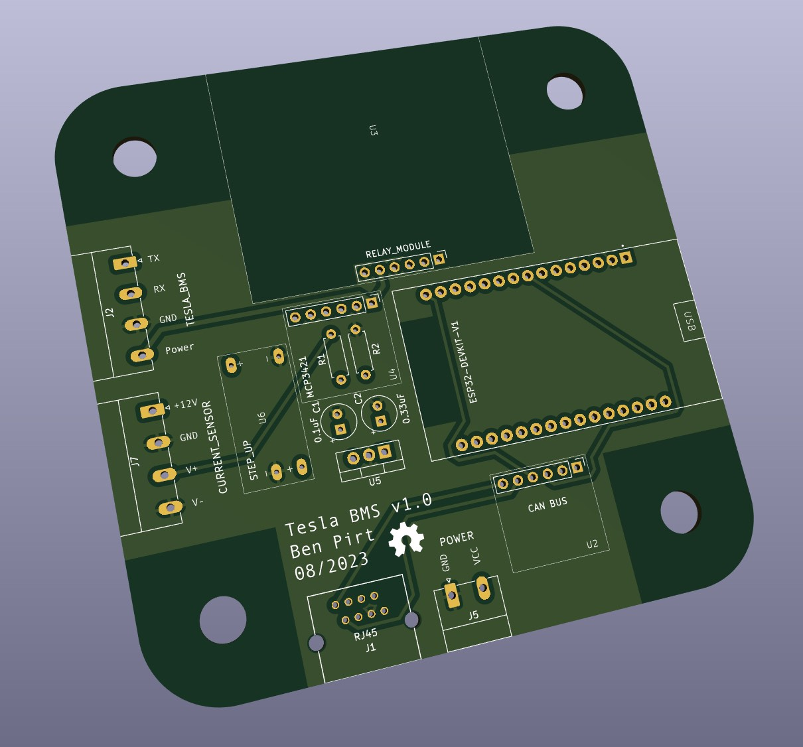

# Hardware

A simple PCB to connect off-the-shelf modules with only through-hole soldering. PCB designed using [KiCad](https://www.kicad.org/). It uses the following components to enable a low-cost BMS controller to be easily built without needing any advanced assembly techniques.

- 30 Pin ESP32 Dev Kit module
- MCU230 CAN transceiver module
- MCP3421 18 Bit ADC module
- 12V Step-up Voltage regulator module
- 3 Way 3.3V relay module
- C2T Bidirectional current sensor
- LM7805 5V Voltage regulator
- Screw terminals

All components are easily sourced from the usual suppliers.

